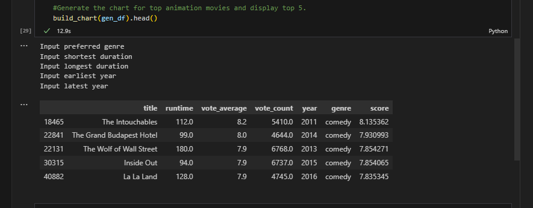

# Hands On Machine Learning Book Reading Reading Report


Here are some highlights of the different notebooks and ideas drawn from the Book That Can be used for building a recommendation system.

**Backlog**

- [ ] Chapter 1
- [ ] Chapter 3a: Simple Recommender System
- [ ] Chapter 3b: Knowledge-Based Recommender System
- [ ] Chapter 4: Content-Based Recommender System
- [ ] Chapter 5: Getting Started with Data mIning Techniques
  - [ ] Similarity Measures
  - [ ] Clustering
  - [ ] Dimensionality Reduction
  - [ ] Evaluation Metrics
- [ ] Chapter 6: Building COllaborative Filtering Recommender System
  - [ ] User-Based Collaborative Filtering
  - [ ] Item-Based Collaborative Filtering
  - [ ] Model-Based Collaborative Filtering
  

## Chapter 3: Knowledge-Based Recommender System 

> Seems to be exloring basic filtering then rating based on the `vote counts` and `vote average` of the movies. to give the recommendations

```py
def build_chart(gen_df, percentile=0.8):
    #Ask for preferred genres
    print("Input preferred genre")
    genre = input()
    
    #Ask for lower limit of duration
    print("Input shortest duration")
    low_time = int(input())
    
    #Ask for upper limit of duration
    print("Input longest duration")
    high_time = int(input())
    
    #Ask for lower limit of timeline
    print("Input earliest year")
    low_year = int(input())
    
    #Ask for upper limit of timeline
    print("Input latest year")
    high_year = int(input())
    
    #Define a new movies variable to store the preferred movies. Copy the contents of gen_df to movies
    movies = gen_df.copy()
    
    #Filter based on the condition
    movies = movies[(movies['genre'] == genre) & 
                    (movies['runtime'] >= low_time) & 
                    (movies['runtime'] <= high_time) & 
                    (movies['year'] >= low_year) & 
                    (movies['year'] <= high_year)]
    
    #Compute the values of C and m for the filtered movies
    C = movies['vote_average'].mean()
    m = movies['vote_count'].quantile(percentile)
    
    #Only consider movies that have higher than m votes. Save this in a new dataframe q_movies
    q_movies = movies.copy().loc[movies['vote_count'] >= m]
    
    #Calculate score using the IMDB formula
    q_movies['score'] = q_movies.apply(lambda x: (x['vote_count']/(x['vote_count']+m) * x['vote_average']) 
                                       + (m/(m+x['vote_count']) * C)
                                       ,axis=1)

    #Sort movies in descending order of their scores
    q_movies = q_movies.sort_values('score', ascending=False)
    
    return q_movies
```





