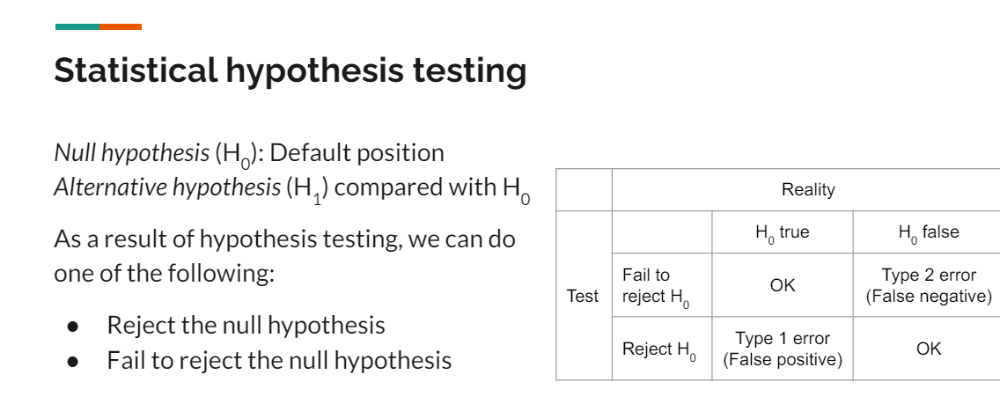

1. Brush up in everything
2. Including Broadcasting.
3. Study from midterm.
4. Clustering
   1. Doesnt ask about writing the algorithm
   2. Familiar with the test what is showing.
5. Previous of the midterm.
6. look over questions in midterm. 
7. More heavily weighted in favor of topics
 True false.
   1. If you perform k-means clustering, different tea, and new teas
1. 25% of the midterm (past classes)
2. Understanding the different algorithms

  - Not classification. Fidning Distinct groups of data.

1. T F

 If you perform k-means clustering on a dataset containing different types of tea, the clustering can help you classify new teas you have never seen before.

1. `False`, K means: It would be fragile, no classification meaning ful way stretch it but is not sued for classifying but for finding groups.

You discover that A is positively correlated with variable B, and the effect is statistically significant. You can conclude that A caused the change in B.

2. `False` Correlation doesn't cause causation.
  
Grouping and aggregating is a good way to smooth noisy data for visualization.
1. `True`,

 In statistical tests, a large p-value is justification for rejecting the null hypothesis.

`False`

- b) When the centroids stop changing position
Because once the 

- That is also the `RMSE` score.
- Is not when all are the same type, because we dont know if they are the same type. 
- K means is titerative.

- Linear Correlation Test:

- Because pearson shows that is a correlation, but it wont give you the change, how much exactly, 
- Linear will literally
- T Test: COmpares the means of different groups
- Chisquared test is for categorical data

How does prinicpal compoenent analysis find the top?

- Look for the direction with the highest variance.

What is type 2 error?
https://www.investopedia.com/terms/t/type-ii-error.asp#toc-type-i-errors-vs-type-ii-errors

- The eror here is that the vast majority doesnt have price
- Is it good idea to perform knn classifications with the dataset as is?
- Not useful for classications, Review audio because you got distracted here.
- Price columns should be removed, because it invalidates all the data/
- Remove first the cols, 

7. Now bad measures, but then, and why there with more clusters it gets mrore clearer, 

8. (X - mu) / variation
   1. Because they are in different scales (orders of magnitude) tthe distance, cannot be seen properly on the chart.
   2. The categorical data (the strings) are expected to change into hot enoding: 

| cumn_depth | flipper | gentoos | adelie | chinstrap |
| ---------- | ------- | ------- | ------ | --------- |
|            |         |         |        |           |

You can't encode it in orders e.g. gentoos = 1, adele =2.. because that would imply a value wise difference.

9. Chi squared:

- What it shows: shows whether they are that right handed, left handed also if they are American or Canadian.

- if there are more canadians, or americans and right handed. 
Null hypothesis: There is no significant relationship between nationalities and right handed and left handed. 
- Output: see if the relationship is there.
  - We fail to reject the null hypothesis: We have cannot reject the null hypotheiss.
  - If the p value then we can reject the null hypothesis: Which is that there IS a relationship between right and left handed.

### Study plan

- Flash the study set.
  - All from Hws avaialbles so far. 
  - All about different testings.
  - All from past exam
  - All from Currect Final Review

Ask:

- Following are my study sources, am I missing something?
- I am a little weak in the statistical study part, I was wondering if there is a thesaurus to study this.
- Is there a list of search first 
- Did we see Chi Square TEst? I cant remember it

